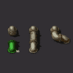

# Automatic Underground Pipe Connectors

A mod for the game Factorio, automatically adding pipes (or pipe ghosts) when
an underground pipe is placed in such a way that the pipe placement is (almost)
always appropriate. This happens when the pipe would connect to another
underground pipe, or to a building or other entity with a fluidbox connection.

## Supporters

Thank you to [Locane](https://mods.factorio.com/user/Locane) for financially
supporting the development of this mod!